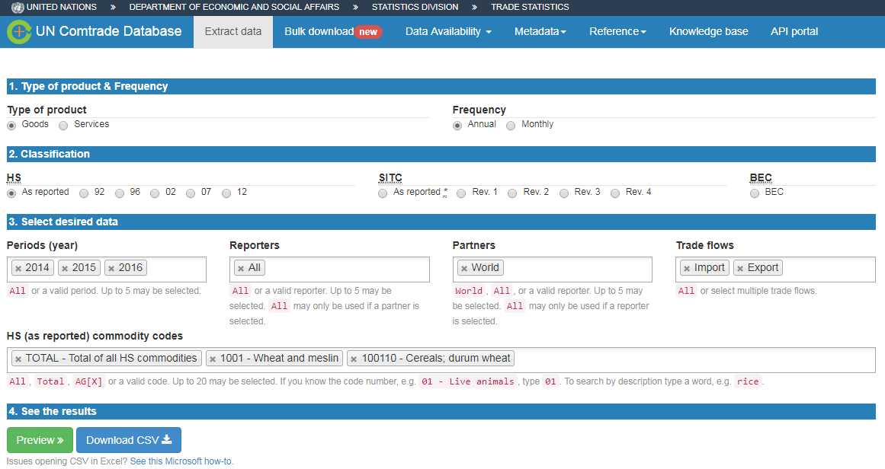
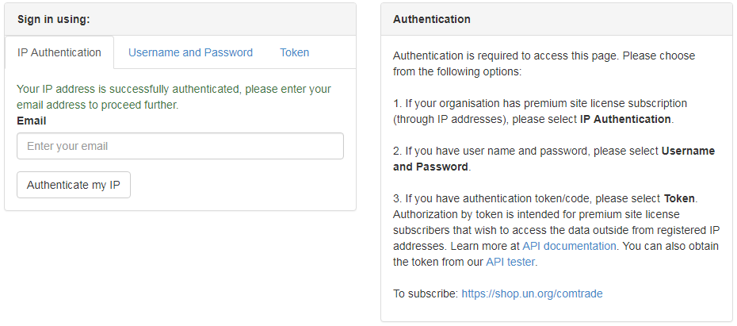
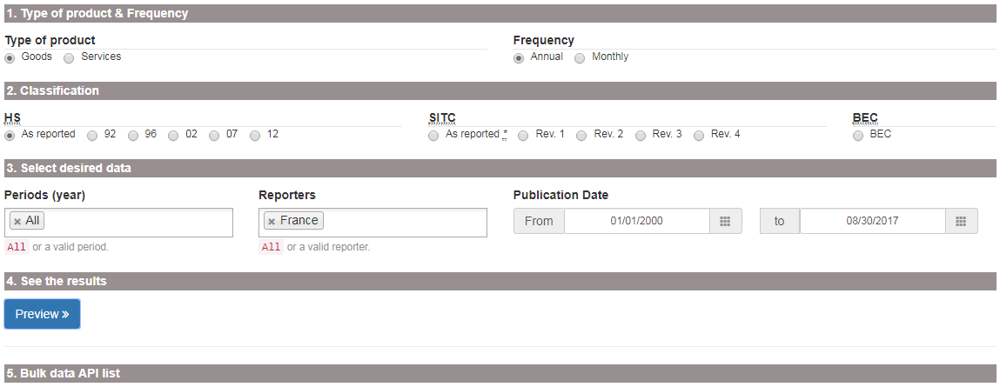
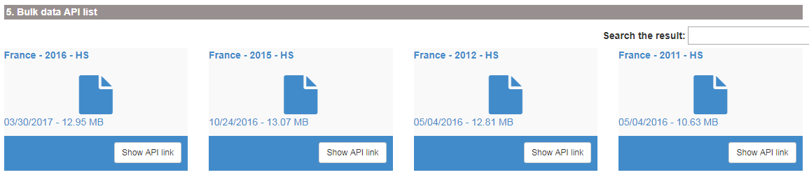
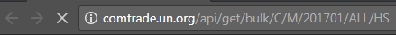

---

Comtrade is a UN based comprehensive trade data collection and dissemination platform maintained and owned by The United Nations Statistics Division (UNSD). From the FAO building, everyone has full access to all Comtrade services. All information is available on the Comtrade website [https://comtrade.un.org/](https://comtrade.un.org/).

In Comtrade there are few main options of data access:

*  Regular download - manually insert a query in the browser and get a table in the browser or download a `.csv` file with selected data;

*  Bulk download - manually insert short query on a web page, or use the browser command line (address line in the browser) to pass arguments to the server. In return, user will download a zip archive with data that covers trade of selected country (or all countries) in one time period (year or month) and specified coding system (HS as reported, HS2007, HS2012, etc.). Bulk download has an option to download data of all reporters for one period/coding system in file;

*  Official and not official data visualization solutions.

---

## Data availability in Comtrade

To save time before starting analysis, it is always good to know data availability in Comtrade. There are two interfaces for data availability analysis:

*  New trade availability visualization tool [https://comtrade.un.org/data/da](https://comtrade.un.org/data/da), where it is possible to explore one country availability or download (clicking `Download` button) an extensive `.csv` file with information about all available data.

*  Old outdated interface for data availability per country, commodity, year and other parameters is available at [https://comtrade.un.org/db/mr/daReportersResults.aspx](https://comtrade.un.org/db/mr/daReportersResults.aspx).

It is also possible to access data availability for the Bulk download. This data is available at the address line call: [http://comtrade.un.org/api//refs/da/view?parameters](http://comtrade.un.org/api//refs/da/view?parameters). More information [here](https://comtrade.un.org/data/Doc/API#DataAvailabilityRequests).

---

## Regular download in Comtrade

**Source**

Regular downloads is available here: [https://comtrade.un.org/data/](https://comtrade.un.org/data/). This is a query based approach to load Comtrade data selecting a specific range of parameters. With the regular download is it possible to obtain a CSV file, which can be analyzes in excel, R, Stata and other tools.

**How to access data**

For an extensive overview, see the tutorial video below ([https://www.youtube.com/watch?v=oflKZUj2BgE](https://www.youtube.com/watch?v=oflKZUj2BgE)).

<iframe width="560" height="315" src="https://www.youtube.com/embed/oflKZUj2BgE" frameborder="0" allowfullscreen></iframe>

The most common query that will return data that we need in 90% of our analysis is the following:

*  Type of product: Goods;
*  Frequency: Annual;
*  HS: As reported (Most frequently used because it combines all codes that were ever recorded);
*  Period: 2014-2016 (Limited up to 5 in regular download);
*  Reporter: All, or anything needed;
*  Partners: World, or anything needed;
*  Trade flow: Import and Export (select Import and Export instead of all to not receive data about re-export and re-import);
*  HS (as reported) commodity codes: Total, any 2, 4 and 6 digits code (11, 1101, 110100).

```{r echo=FALSE}

```

**Data response**

Normally, data is returned in the long format with the variables describing main data dimensions selected above and variables with Trade quantities, Trade value, and units of measurement.

---

## Bulk download in Comtrade

Comtrade bulk download is available at the web page [https://comtrade.un.org/data/bulk](https://comtrade.un.org/data/bulk).

There are two options how to access bulk data in Comtrade:

*  Web based query in the browser. Link: [https://comtrade.un.org/data/bulk](https://comtrade.un.org/data/bulk);
*  API call based approach to load Comtrade data. Link: [https://comtrade.un.org/data/doc/api/bulk/](https://comtrade.un.org/data/doc/api/bulk/). 

### Web based bulk query

**Source**

Web based query for accessing Comtrade bulk data in the browser is available here: [https://comtrade.un.org/data/bulk](https://comtrade.un.org/data/bulk). 

First time you need to access it from the FAO buildings in order to authorize your email. Insert your email in the "Enter your email" field and press "Authenticate my IP". After that your email will be saved in the Comtrade database and you will be grated with the access to the bulk download interface (same address [https://comtrade.un.org/data/bulk](https://comtrade.un.org/data/bulk)).

```{r echo=FALSE}

```

**How to access data**

In order to access Comtrade bulk data on the bulk data access page select required set of parameters. For example, to download bulk commodity statistics for France, select:

*  Type of product: Goods;
*  Frequency: Annual;
*  HS: As reported;
*  Period: All;
*  Reporter: France (or All - all reporters in one file or any single reporter that you needed);
*  Publication data: keep unchanged.

```{r echo=FALSE}

```

After clicking "Preview" yo will be returned with the list of all bulk data files available for your selection. Clicking on any of them will run the file, clicking on "Show API link" will provide you with the API data request command (see the next subsection) for returning a bulk data file. Be aware that any bulk data file could range in size from 1 to 500 megabyte. 

```{r echo=FALSE}

```

**Data response**

Your browser will download one `zip` archive with data for a selected country (all countries), period and classification.

**Attention!** Data files could be very. In zipped format file size may range from 1 to 500 megabyte. Un extracted format, file size could be up to 9 gigabytes.

### API bulk query

**Source**

If you do not want to click in the browser, you can use the API for accessing Comtrade data. Extensive explanation about the Comtrade API tools is available here [https://comtrade.un.org/data/doc/api/bulk/](https://comtrade.un.org/data/doc/api/bulk/).

**How to access data**

To access Comtrade bulk data with API, we need to construct a request, insert it to the browser command line and run it.

To request a bulk data file we need to use the specific format explained [here](https://comtrade.un.org/data/doc/api/bulk/#DataRequestsDwn). The main idea is to construct a request based on the template `http://comtrade.un.org/api/get/bulk/{type}/{freq}/{ps}/{r}/{px}?{token=}` specifying correct [parameters](https://comtrade.un.org/data/doc/api/bulk/#DataRequests): 

*  `type` - trade type C - Commodities of S - Services;
*  `freq` - frequency A - Annual or M - Monthly;
*  `ps` - period coverage for annual data `ps=YYYY` - e.g. `ps=2010`, for monthly `ps=YYYY` or `ps=YYYYMM`;
*  `r` - reporter area code - e.g. `r=804` or `r=All`. Extensive list available [here](https://comtrade.un.org/data/cache/reporterAreas.json);
*  `px` - classification, available values are: HS - Harmonized System (HS) as reported, H0-HS 1992, H1-HS 1996, H2-HS 2002, H3-HS 2007, H4-HS 2012 and others  [see](https://comtrade.un.org/data/doc/api/bulk/);
*  `token` - optional parameter for data from outside of the authorized network.

For example, we want to request monthly data `freq=M` of commodities trade `type=C` for All reporters `r=ALL` for period January, 2017 `ps=201701`, in the HS as reporter classification `px=HS`. The request is [`http://comtrade.un.org/api/get/bulk/C/M/201701/ALL/HS`](http://comtrade.un.org/api/get/bulk/C/M/201701/ALL/HS). We insert this request to the browser adders line and download the file.

```{r echo=FALSE}

```

**Data response**

Your browser will download one `zip` archive with data for a selected country (all countries), period and classification.

**Attention!** Data files could be very. In zipped format file size may range from 1 to 500 megabyte. Un extracted format, file size could be up to 9 gigabytes.

---

## Data visualization options

UN Comtrade lists several visualization platforms on the page [https://comtrade.un.org/labs/](https://comtrade.un.org/labs/). Here, we will discuss some of them in more details.

### Comtrade data-explorer

Comtrade data explorer [https://comtrade.un.org/labs/data-explorer/](https://comtrade.un.org/labs/data-explorer/)
(unfortunately was not working on 2017-08-31). A tool for visualization of the main trade flows between selected reporters and partners of the selected commodity. Here, you will find a `.pdf` guidelines on [how to use](https://comtrade.un.org/labs/data-explorer/UserGuide%20UN%20Comtrade%20Analytics.pdf) Comtrade data-explorer.

**Limitations:** 

*  Commodities are not defined using the HS commodity codes, but as a free text, therefor, it is difficult to understand the meaning behind some commodity names. 
*  Options of custom-defined aggregates of countries or commodities are not available.

### Bilateral trade exploration tool

BIS trade in goods tool is available at [https://comtrade.un.org/labs/BIS-trade-in-goods/](https://comtrade.un.org/labs/BIS-trade-in-goods/) it allow to visualize trade of a selected good from a selected reporter to all or selected partner. 

**Limitations:** 

*  Commodity coverage is limited to the 2 digits HS commodity description;
*  Options of custom-defined aggregates of countries or commodities are not available.

---

## General Comtrade related information

Official introduction in how to use Comtrade [https://unstats.un.org/unsd/tradekb/Knowledgebase/50049/How-to-use-UN-Comtrade](https://unstats.un.org/unsd/tradekb/Knowledgebase/50049/How-to-use-UN-Comtrade).

Official "What is Comtrade" page [https://unstats.un.org/unsd/tradekb/Knowledgebase/What-is-UN-Comtrade](https://unstats.un.org/unsd/tradekb/Knowledgebase/What-is-UN-Comtrade). 

Old Comtrade data access interface [https://comtrade.un.org/db/default.aspx](https://comtrade.un.org/db/default.aspx).

### Metadata and documentation

Generally, all information related to Comtrade metadata is organised here: [https://unstats.un.org/unsd/tradekb/Knowledgebase/](https://unstats.un.org/unsd/tradekb/Knowledgebase/). 

If you are looking for the country specific data publication notes, they are available at [https://comtrade.un.org/db/mr/daPubNoteDetail.aspx](https://comtrade.un.org/db/mr/daPubNoteDetail.aspx) with more information [here](https://unstats.un.org/unsd/tradekb/Knowledgebase/50127/Introduction-of-Publication-Notes-?Keywords=notes). API interface for accessing publication notes is explained [here](https://unstats.un.org/unsd/tradekb/Knowledgebase/50118/Publication-Notes-Via-Web-Service?Keywords=notes) and [here](https://unstats.un.org/unsd/tradekb/Knowledgebase/50117/Explanatory-Notes-Via-Web-Service?Keywords=notes).

### Commodity mapping tables

Mapping tables for conversion between different coding systems (HS 2012 to HS 2002 or SITC) are here: [https://unstats.un.org/unsd/trade/classifications/correspondence-tables.asp](https://unstats.un.org/unsd/trade/classifications/correspondence-tables.asp).Please note, that conversions are only available from the most recent coding system to the older version because most of the new coding systems are dis-aggregating previously existing ones.

Detailed information on the statistical classification of the commodities could be found here [https://unstats.un.org/unsd/class/default.asp](https://unstats.un.org/unsd/class/default.asp).

To convert between the FAOSTAT commodities and HS/SICT classification, see official FAOSTAT conversion tables [http://www.fao.org/economic/ess/ess-standards/commodity/en/](http://www.fao.org/economic/ess/ess-standards/commodity/en/) or contact ESS division. 

### Country classification

Please note Comtrade, FAOSTAT and UNSD all have different country classification. Although, all of them might be similar, there are some peculiarities in classifying some European countries as well as politically sensitive countries. Clear data classification tables are available at [https://comtrade.un.org/db/mr/rfReportersList.aspx](https://comtrade.un.org/db/mr/rfReportersList.aspx) and [http://www.fao.org/faostat/en/#definitions](http://www.fao.org/faostat/en/#definitions).

