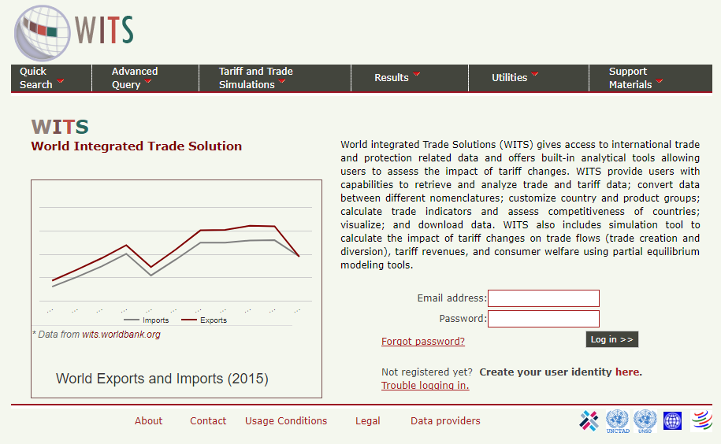
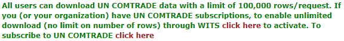

---

World Bank offers great variety of databases on the subject of trade, agriculture and many others. The full list is available [here](https://data.worldbank.org/data-catalog/?tab=topics). We will discuss some selected data sources in more details below. In particular, we will focus on:

*  World Integrated Trade Solution (WITS)

*  __**TC**data**360**__

*  Miscellaneous data sources

---

## WITS

**Source**

World Integrated Trade Solution is located here: [http://wits.worldbank.org/](http://wits.worldbank.org/). However, this is the guest users interface with the access to simple summary data. If you need to access full capabilities of WITS database, you need to log-in [here](https://wits.worldbank.org/WITS/WITS/Restricted/Login.aspx) (see more details below). 

WITS database is a website, that uses trade and tariff data from various sources (UN Comtrade, WTO, World Bank) in order to provide users with the interface for generating own trade statistics and indicators. WITS application also provides tools to perform single and multi-market tariff cut simulations. Extensive description of the methodology, used by WITS is located here: [http://wits.worldbank.org/methodology.html](http://wits.worldbank.org/methodology.html).

WITS provides multiple ways to access trade, tariff and non-tariff data. It has the following main sections.

*  TradeStats: Summary trade, tariff, non-tariffs and development indicators;
*  Analytical Databases: Databases derived using official trade data sources;
*  Global Preferential Trade Access Database (GPTAD): Search across different preferential trade agreements.

For more information, see this introductory [overview video](http://wits.worldbank.org/videos/tradestatshome.html).

<video id="Video1" controls="" loop="" height="315">
<source src="http://wits.worldbank.org/data/public/WITS_videos/wits/tradestats-home.mp4" type="video/mp4">
</video>

**How to access data**

WITS is a complex tool, however it has a very good set of [learning materials](http://wits.worldbank.org/training.html#). If you have time, you can take an [eLearning course](http://wits.worldbank.org/WITS/Training/player.html), otherwise, it is possible to follow [video tutorials from WITS](http://wits.worldbank.org/trainingVideos.aspx?lang=en).

**Registration and login**

In order to use full capabilities of the WITS database all users need to log-in. The log in page is located [here](https://wits.worldbank.org/WITS/WITS/Restricted/Login.aspx). You can access this page from the main [WITS website](http://wits.worldbank.org), by clicking first 'Register' in the top right corner `r knitr::include_graphics("diagrams/wits-login-button.PNG")`. Follow all registration instructions. People with the FAO email are allowed to register in WITS and use all available capacities of the database. After you have finished your registration, click 'log in' in the same top-right corner of the [WITS website](http://wits.worldbank.org), enter your email and password and you will log into the WITS database:

```{r echo=FALSE}

```

**Other important informatoin**

When the user are logged into WITS, the website offer a greater range of documentation and metadata. In particular: 

*  WITS data availability report can be explored and generated [here](http://wits.worldbank.org/WITS/WITS/Support%20Materials/ComtradeCatalog.aspx?Page=DataCatalog), it is only possible after log in;

*  Reference tables for converting countries, commodities and classifications are [here](http://wits.worldbank.org/referencedata.html);

*  Detailed product nomenclature is [here](http://wits.worldbank.org/WITS/WITS/Support%20Materials/CMTNomenclatureandConcordancesList.aspx?Page=ProductNomenclatureandConcordances);

*  Comprehensive WITS guide is [here](http://wits.worldbank.org/WITS/WITS/WITSHELP/WITSHelp.htm);

*  WITS has a developed API interface for direct data access from a programming environment. More information is available [here](http://wits.worldbank.org/witsapiintro.aspx). Here is the [WITS-API USER GUIDE](http://wits.worldbank.org/data/public/WITSAPI_UserGuide.pdf).

### WITS Trade data 

There are two main types of trade data in WITS, (1) UN Comtrade up to 6 digits oh HS classification trade data and (2) UN Comtrade Tariff-line data. To access UN Comtrade data we only need to log in to WITS with our user name (email) and password. However, if we want to extract bulk Comtrade data, we may need to provide our Comtrade data access token (see more details below).

#### Advance query for trade data access

The main tool of generating user-defined trade data reports from the UN Comtrade data in WITS is in using the [`Home > Advanced Query > Trade Data (UN Comtrade)`](http://wits.worldbank.org/WITS/WITS/AdvanceQuery/RawTradeData/QueryDefinition.aspx?Page=RawTradeData). Here you can select any reporters, partners, commodities, periods, and classification systems in order to generate desirable table with the trade data.

**Important** to note. At this step our queries are limited to the maximum of 100 000 rows. In order to be able to download more than 100 000 rows, you either need to log in from the FAO network, or provide a UN Comtrade token to the WITS database by clicking "click here to activate" on the page [`Home > Advanced Query > Trade Data (UN Comtrade)`](http://wits.worldbank.org/WITS/WITS/AdvanceQuery/RawTradeData/QueryDefinition.aspx?Page=RawTradeData) and follow the instructions: 

```{r echo=FALSE}

```

A comprehensive instruction on how to use advanced queries is provided in the WITS [tutorial video](http://wits.worldbank.org/videos/advanced-query.html).

<video id="Video1" controls="" loop="" height="315"> <source src="http://wits.worldbank.org/data/public/WITS_videos/wits/Advanced%20Query%20-%20Trade%20Data.mp4" type="video/mp4"> </video>

**IMPORTANT about ommodity classfication** Selecting the commodity classification is always tricky, when you want to construct a consistent time series they covers multiple years (5 and more)? you may find that more modern HS classifications will not be available in the past. For tackle this problem you need to switch to the old HS classification, such as HS 2002 or even HS 1992. Be ready, that the coding system in the old HS classifications may differ significant. To overcome this problem, check the [WITS mapping tables](http://wits.worldbank.org/WITS/WITS/Support%20Materials/CMTNomenclatureandConcordancesList.aspx?Page=ProductNomenclatureandConcordances) or [tables of concordance](http://wits.worldbank.org/product_concordance.html). 

#### User defined groups of commodities and countries

Tutorial video Highlights both options for user defined grouping of data. The best description of how to create and use the user-defined country and commodity groups is described in the WITS e-learning [here](http://wits.worldbank.org/WITS/Training/player.html) in the sections 20 and 21. Please check them for the guided instructions.

The lists of standard - predefined commodities and country groups are here:  [http://wits.worldbank.org/referencedata.html](http://wits.worldbank.org/referencedata.html) in the sections `Products` and `Countries`.

#### Tariff-line and bulk Comtrade data

WITS offers a user friendly interface for accessing [Tariff-line data (link to the interface)](http://wits.worldbank.org/WITS/WITS/QuickQuery/Trade-ViewAndExportRawData/ViewAndExportRawData.aspx?Page=TradeViewAndExportRawData) and [bulk Comtrade data (link to the interface)](http://wits.worldbank.org/WITS/WITS/AdvanceQuery/BulkExport/BulkExportQueryDefination.aspx?Page=BulkExport). Practically, this interface repeats the one available in the Comtrade. To learn more about how to use it, see:

*  [Tariff-line tutorial video](http://wits.worldbank.org/videos/trade%20-%20view-and-export-tariff-line-imports.html);

<video id="witsTariffLine" controls="" loop="" height="315"> <source src="http://wits.worldbank.org/data/public/WITS_videos/wits/Trade%20-%20View%20and%20export%20tariff-line%20imports.mp4" type="video/mp4"> </video>

*  [WITS bulk donwload tutorial video](http://wits.worldbank.org/videos/bulk-download-un-comtrade.html).

<video id="witsBulkVideo" controls="" loop="" height="315"> <source src="http://wits.worldbank.org/data/public/WITS_videos/wits/Bulk%20Download%20(UN%20Comtrade).mp4" type="video/mp4"> </video>

### Triffs data

WITS Trade and Tariffs data offers access to the UNCTAD and WTO databases and the tariffs data in particular. It is available on the [`Home > Advanced Query >Tariff and Trade Analysis`](http://wits.worldbank.org/WITS/WITS/AdvanceQuery/TariffAndTradeAnalysis/AdvancedQueryDefinition.aspx?Page=TariffandTradeAnalysis) page.  To get to know how to use this data, see [this tutorial video](http://wits.worldbank.org/videos/tariff-advanced-query.html).

<video id="witsTarrifsVideo" controls="" loop="" height="315"> <source src="http://wits.worldbank.org/data/public/WITS_videos/wits/Advanced%20Query%20-%20Tariff%20and%20Trade%20Analysis.mp4"> </video>

It is also possible to download bulk tariff data from the UNCTAD TRAINS database directly from WITS. You need to follow [`Home > Advanced Query >Bulk Download (TRAINS)`](http://wits.worldbank.org/WITS/WITS/AdvanceQuery/TRAINSBulkExport/TRAINSBulkExportQueryDefination.aspx?Page=TRAINSBulkExport) to access the download interface. For more information, see [tutorial documentation](http://wits.worldbank.org/data/public/Help_BulkDownload_TRAINS.pdf) and [tutorial video](http://wits.worldbank.org/videos/bulk-download-unctad-trains.html) below:

<video id="witsTradeProfiles" controls="" loop="" height="315"> <source src="http://wits.worldbank.org/data/public/WITS_videos/wits/Bulk%20Download%20(TRAINS).mp4"> </video>

### Trade indicators

The Trade Outcomes Indicators tool lets you to construct numbers of trade indicators that are classified into four dimensions of trade performance: Orientation and Growth, Export Diversification, Export Sophistication, and Export Survival. All calculations are performed by the WITS, according to the [published methodology](http://wits.worldbank.org/WITS/docs/TradeOutcomes-UserManual.pdf) based on the UN Comtrade data.

To see explicit details on how to use Trade Outcomes Indicators, see [this video](http://wits.worldbank.org/videos/trade-outcomes-indicators.html). 

<video id="trade-outcome-indicators" controls="" loop="" height="315">
<source src="http://wits.worldbank.org/data/public/WITS_videos/wits/Trade%20-%20View%20and%20export%20tariff-line%20imports.mp4" type="video/mp4">
</video>

---

## TCdata360

**Source**

**TC**data**360** provides open data on trade and competitiveness. The site aggregates and visualizes data from multiple sources and presents it in tandem with other knowledge and resources. The website is available at [https://tcdata360.worldbank.org/](https://tcdata360.worldbank.org/). At TCdata360 offers a wide range of user friendly instruments for trade data comparison and analysis'. 

See this brief guide video:

<iframe width="560" height="315" src="https://www.youtube.com/embed/EJuEAVyor68?rel=0&amp;showinfo=0" frameborder="0" allowfullscreen></iframe>

**How to access data**

This is a purely analytic tool with very intuitive interface. Unfortunately, there are no guides, which would describe all possibilities of data access options. Some main features are explained here: [https://tcdata360.worldbank.org/faq](https://tcdata360.worldbank.org/faq).

**Developers options**

There are numerous options of data access for developers and different software, so-called API interface. To see more about it visit [https://tcdata360.worldbank.org/tools](https://tcdata360.worldbank.org/tools). 

---

## Miscellaneous

### Most recent WB researches on trade

*  This is the [website](http://econ.worldbank.org/WBSITE/EXTERNAL/EXTDEC/EXTRESEARCH/EXTPROGRAMS/EXTTRADERESEARCH/0,,menuPK:544860~noSURL:Y~pagePK:64168176~piPK:64168140~theSitePK:544849,00.html) dedicated to the ongoing researches on trade conducted by of the World Bank.

*  Comprehensive search over the WB researches [is here](http://documents.worldbank.org/curated/en/docsearch). 

*  Generic website with the modern interface for searching through the WB researches is [here](https://openknowledge.worldbank.org/browse).

### Temporary Trade Barriers Database 

The Temporary Trade Barriers Database (TTBD) contains detailed data on more than thirty different national governments’ use of policies such as [antidumping (AD)](http://econ.worldbank.org/ttbd/gad/), global safeguards (SG), China-specific transitional safeguard (CSG) measures, and countervailing duties (CVD). 

For more information, see the [Temporary Trade Barriers Database and Global Antidumping Database](http://econ.worldbank.org/WBSITE/EXTERNAL/EXTDEC/EXTRESEARCH/EXTPROGRAMS/EXTTRADERESEARCH/0,,contentMDK:22561572~pagePK:64168182~piPK:64168060~theSitePK:544849,00.html).


### Trade costs database

The Trade Costs database provides estimates of bilateral trade costs in agriculture and manufactured goods for the 1995-2015 period. It is built on trade and production data collected in 178 countries.

The database is available [here](http://databank.worldbank.org/data/reports.aspx?source=escap-world-bank-international-trade-costs).

### Interface to access UNCTAD TRAINS data

The [UNCTAD Trade Analysis Information System (TRAINS)](http://unctad.org/en/Pages/DITC/Trade-Analysis/Non-Tariff-Measures/NTMs-trains.aspx) is a comprehensive computerized information system at the HS-based tariff line level (HS 6-digit). The database provides data on trade control measures, including:

*  Tariffs;
*  Para-tariffs;
*  Non-tariff measures;
*  Imports by suppliers at HS 6-digit level.

The interface is available [here](http://databank.worldbank.org/data/reports.aspx?source=UNCTAD-~-Trade-Analysis-Information-System-(TRAINS)).

